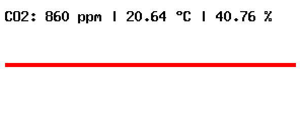
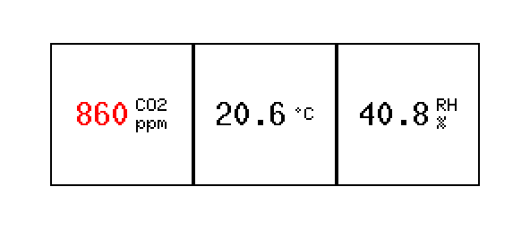
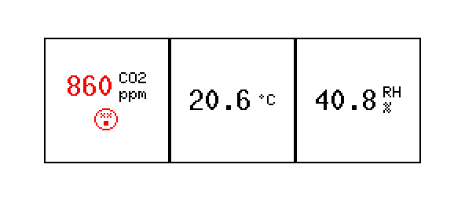

# Display Themes

## Examples
Themes can be simulated with the `simulate_theme` example which uses [embedded-graphics-simulator](https://crates.io/crates/embedded-graphics-simulator)

E.g.
```
cargo run --example simulate_theme --features theme2 -- -c 860 -t 20.6 -r 40.7
```

To create a screenshot:
```
EG_SIMULATOR_DUMP=docs/theme2.png cargo run --example simulate_theme --features theme2 -- -c 860 -t 20.644 -r 40.756
```

## Themes

### Theme 1


### Theme 2


### Theme 3

